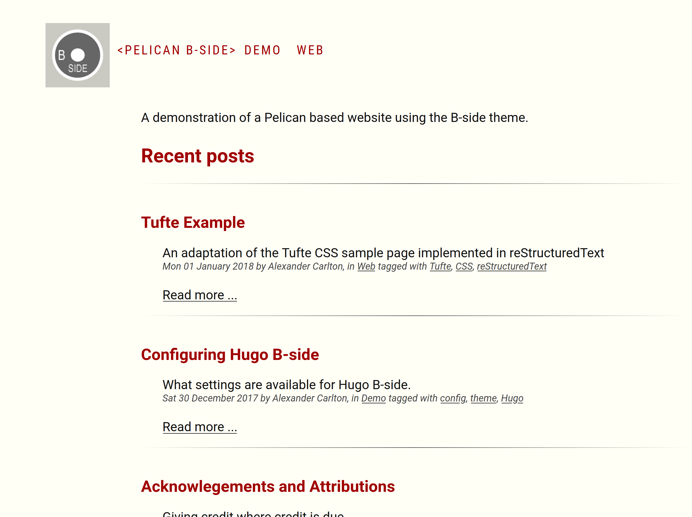
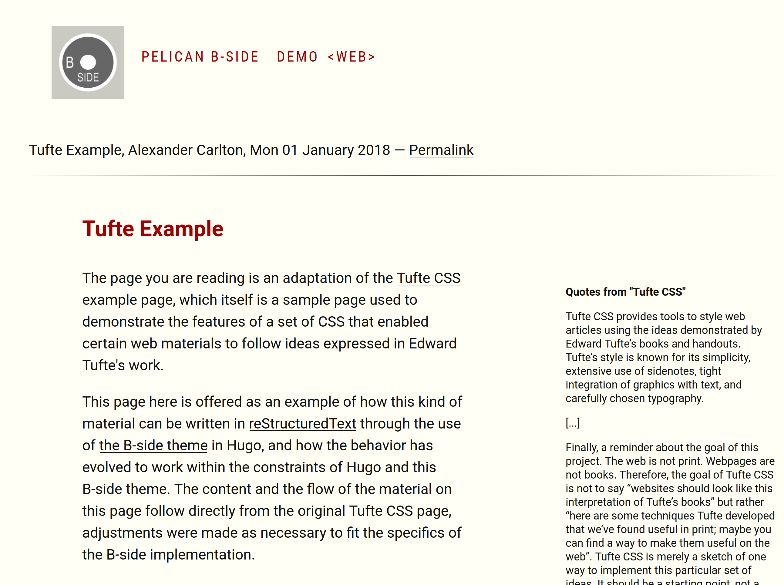

Pelican B-side
==============

What is this?
-------------

This repo contains a fairly shoddy port of the beautiful 
`Hugo B-side theme <https://github.com/fisodd/hugo-b-side>`_ to Pelican
(Jinja). Currently doesn't match the original as exactly as I'd like, 
contributions are welcome.

The original project's 
`live demo site <https://hugo-b-side-demo.netlify.com/>`_ is a wonderful
example of how the theme looks, and does a great job of explaining *why 
reStructuredText?*

Another live demo for this Pelican version can be found
`here <https://jhauh.gitlab.io/pelican_b_side_demo>`_, and 
there are screenshots towards the bottom of this README.

Installation
------------

Copy the contents of this repo into the ``theme`` folder of your pelican
site (or wherever the ``THEME`` variable in your ``pelicanconf.py``
points to). Alternatively if you prefer things separated, clone it 
elsewhere and use the 
`pelican-themes <https://docs.getpelican.com/en/stable/pelican-themes.html>`_
command line tool.

This theme is designed to be combined with content written in 
reStructuredText. If you already have material in Markdown, 
`pandoc <https://pandoc.org/>`_ can help to convert it.

Why does this exist?
--------------------

Always a good question.

*If you wanted to use B-side, why didn't you just convert your site to 
Hugo?*  

By all means, if that's the shortest path between your current site and 
your desired site then that's absolutely what you should do. However, 
although the two SSGs share a number of features, some functionality 
is exclusive to one; e.g. certain extensions. This may make porting
everything difficult.

Or perhaps you simply prefer to drop down into Python when need be, 
rather than Go.

As for the original question of why this exists, porting B-side turned 
out to be a useful exercise for the author to learn Jinja and understand
how Pelican works.

Differences
-----------

As stated, this is not a perfect port, and therefore there are places
where it is a little bit more B-side/Hugo -like, and so breaks from 
Pelican traditions. Similarly, there are some elements found in the
original which have not been implemented (yet) in this theme. All the 
differences I am aware of are listed below. Open an issue if you find 
more!

Between Pelican B-side and Hugo B-side
++++++++++++++++++++++++++++++++++++++

- The way Hugo and Pelican (and the docutils underneath) processes 
  reST files is apparently not the same, so the produced HTML is not 
  identical. Mostly it will be, and some tweaks have been added to PBS
  where differences have been identified, but I'm sure there are more. 
- Pelican B-side *should* adhere to the world of Pelican for the most 
  part, so all your non-default ``pelicanconf`` settings should work.
  E.g. Pagination, non-default slugs, Atom/RSS feeds etc. Maybe Hugo
  has all of these by default without the theme needing to care, but I 
  am not sure about this.
- Default date format is different.
- By default PBS does not fall back to naming the default author given 
  by the ``AUTHOR`` variable on pages where none is explicitly provided
  by the article or page in question.
- No Google Analytics in the header for production/deployment. Can be 
  added back in easily.
- No Hugo (or Pelican equivalent) ref in the header to track usage. 

Between Pelican B-side and other Pelican theme conventions
++++++++++++++++++++++++++++++++++++++++++++++++++++++++++

- Either use a big title at the top of your document, or the ``:title:``
  directive, not both.
- The ``SITEDESCRIPTION`` variable in ``pelicanconf`` can be used to add
  some text to the default homepage, ``index.html``.
- Use ``BADGE_IMAGE`` for the header image (remember to add its location
  to ``STATIC_PATHS``).
- By default, pages, the index and other list-like pages (namely 
  ``authors``, ``categories`` and ``tags``) are styled as a single, wide
  column, while articles are given the two-column sidebar treatment. 
  This can be changed by setting ``:type:`` to ``"wide"`` or ``"post"``
  on any content.
- PBS *should* handle cases where ``*_URL`` and ``*_SAVE_AS`` are 
  changed from their defaults, but it may fail to properly link them in
  summaries if you use something too wacky. 

Screenshots
-----------

Acknowledgements
----------------

`Alexander Carlton <https://www.fisodd.com>`_ created B-side. It's 
clear that care and effort went into the project, and I am grateful for
the extensive reasoning and discussion on its many design decisions 
found in the live demo.
